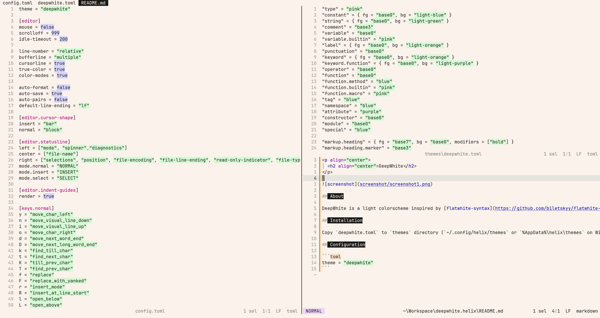

<p align="center">
  <h2 align="center">DeepWhite</h2>
</p>



## About

DeepWhite is a light colorscheme inspired by [flatwhite-syntax](https://github.com/biletskyy/flatwhite-syntax) and [elegant-emacs](https://github.com/rougier/elegant-emacs).

## Installation

Copy `deepwhite.toml` to `themes` directory (`~/.config/helix/themes` or `%AppData%\helix\themes` on Windows).

## Configuration

```toml
theme = "deepwhite"
```
